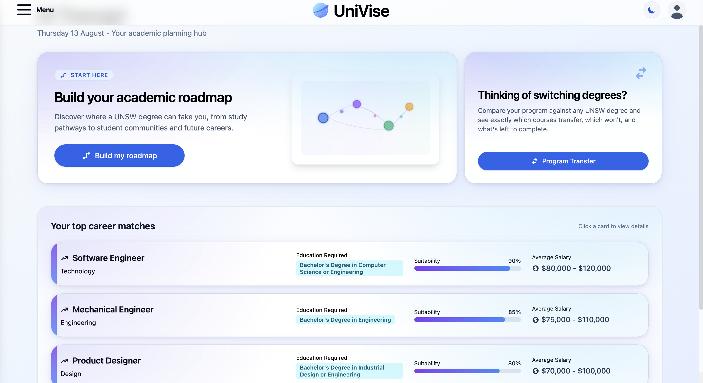
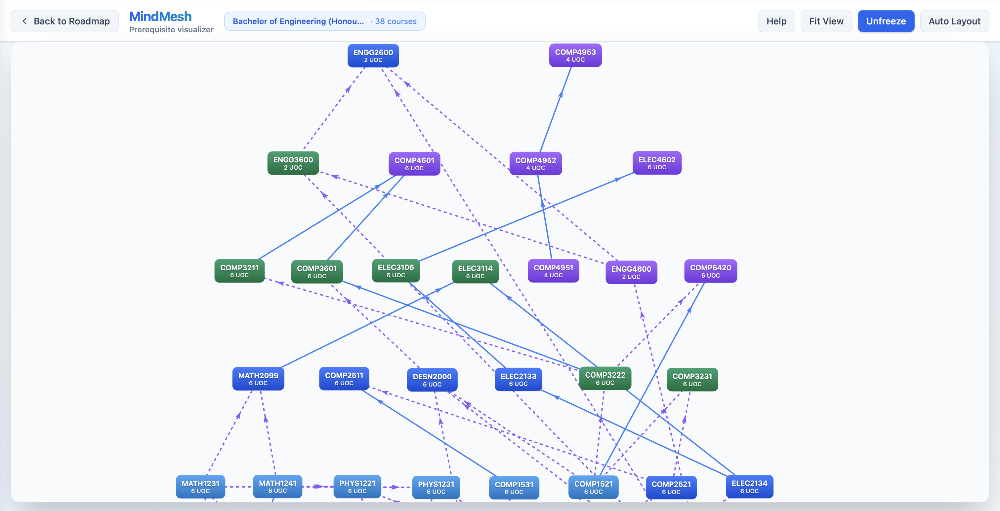

# UniVise - Academic and Career Planner for UNSW Students

UniVise is an AI-powered academic and career planning platform for UNSW students. It takes thousands of scattered handbook rules, prerequisites, and specialisation requirements and turns them into a clear picture of where a degree leads, what switching programs would actually cost, and which careers it opens up. Built as an Honours research thesis at UNSW Sydney on AI systems for aligning university courses, majors, and career choice.

It shares a platform with a parallel Honours thesis by [David Choi](https://github.com/dchoi03) on AI-powered guidance for high school students, so the system serves both prospective and current university students.

---

## Motivation

Degree planning at UNSW is spread across handbook pages, program rules, and specialisation requirements that rarely line up. Four gaps follow from that.

1. **Rules are fragmented.** Prerequisites, progression constraints, and specialisation requirements live in different places and formats, so reasoning about a pathway end to end is hard.

2. **Switching programs is a guess.** Students considering a transfer have no clear view of what carries over, what does not, or what it costs in extra terms.

3. **Prerequisite chains surface too late.** Bottleneck courses are usually discovered after they have already delayed progression or closed off a specialisation.

4. **Career links are indirect.** Students want to know how program choices map to real roles and employers, but that connection is scattered at best.

UniVise pulls these into one place: structured program data scraped from the UNSW handbook, rule-aware program comparison, prerequisite graph visualisation, and AI-generated advice grounded in that data.

---

## Key Features

### Dashboard

The planning hub: career matches ranked by suitability and salary, with entry points into roadmap generation and program transfer.

### Roadmap Generation

A full program pathway, sequencing courses and showing how requirements are satisfied over time for a chosen specialisation. Societies, industry experience, and career pathways generate in the background, linked through to real employers.

### Program Transfer

Compares a current program against a target: what transfers, what does not, what is left, and what it costs in extra terms. An AI advisor weighs those facts alongside the student's personality profile to reach a verdict, not just a score.

### Prerequisite Graph (MindMesh)

Course dependencies as a force-directed network, exposing prerequisite chains and the bottleneck courses that gate the most options.

---

## System Overview

A React frontend, a FastAPI backend, and a PostgreSQL database, with an LLM layer that spans Anthropic and OpenAI and picks a model per task for quality and cost.

### Stack

| Layer | Technology |
|---|---|
| Frontend | React 19, Vite, TailwindCSS 4, React Router 7 |
| Backend | FastAPI, Python 3.12 |
| Database | PostgreSQL with row level security policies on every table, managed on Supabase |
| AI Layer | Anthropic Claude (Sonnet 4.6, Haiku 4.5) and OpenAI (GPT-5.4-mini, GPT-4o mini), selected per task |
| Graphs | react-force-graph, graphology |
| Auth | Google OAuth with JWT bearer tokens, validated on every protected endpoint |

### How It Works

A request hits CloudFront, then FastAPI on Lambda. Program rules, course data, and prerequisites come from Postgres, and the backend computes the structured facts first: transfer rates, prerequisite chains, remaining requirements, extra terms. Only then does it call the LLM layer, with independent prompts running in parallel.

The models reason over facts the backend has already computed, not over raw handbook text. That keeps advice grounded in real program rules rather than in whatever the model recalls about UNSW.

### Deployment

| Component | Service |
|---|---|
| Frontend | S3 serving the Vite build, delivered by CloudFront with SPA fallback and HTTPS via ACM |
| Backend | Lambda running an arm64 container, with the Lambda Web Adapter running FastAPI as a real uvicorn server so streaming works |
| API delivery | CloudFront at `api.uni-vise.com`, caching disabled for personalised responses |
| Images | ECR, tagged by commit SHA |
| Secrets | AWS Secrets Manager, loaded at runtime |
| CI/CD | GitHub Actions on push to `main`, authenticated by OIDC with no stored AWS keys |
| Monitoring | CloudWatch alarms on errors, throttles, and p95 duration, notified through SNS |

---

## Using It

1. Sign in with Google, then complete the short onboarding survey and personality quiz.
2. Generate a roadmap for your program, and open MindMesh inside it to see prerequisite chains and bottleneck courses.
3. In **Program Transfer**, pick your current and target program, with specialisations.
4. Review the transfer summary and recommendation.

---

## Licence

This project was developed as Honours research at UNSW Sydney. It is not licensed for reuse or redistribution.
