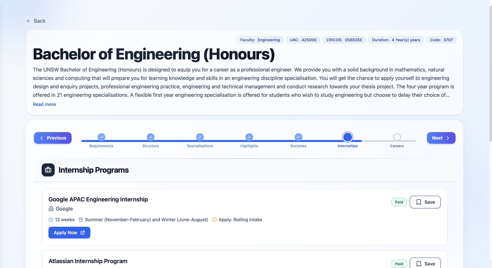
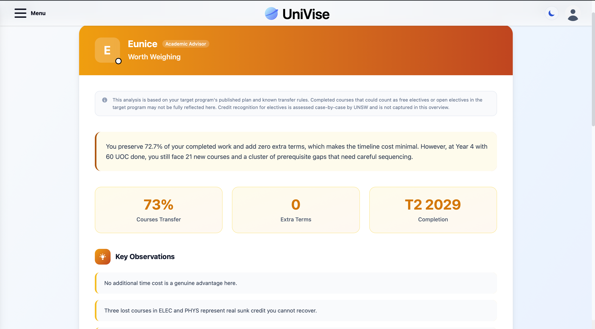

# UniVise — Academic Planning and Program Transfer Advisor

**Live demo: [https://uni-vise.com](https://uni-vise.com)**

UniVise is an AI-powered academic advising and planning platform designed to help university students understand how their degree structure, specialisations, prerequisites, and career outcomes fit together. The system was developed as part of an Honours research thesis investigating AI-driven academic advising systems at UNSW Sydney.

The broader platform was built in collaboration with a parallel Honours thesis by [David Choi](https://github.com/dchoi03), which focused on AI-powered university guidance for high school students. Together, the system supports both prospective and current university students through separate advisory pathways.

---

## Status

The platform is deployed and maintained at [uni-vise.com](https://uni-vise.com). The source is published for reference rather than for self-hosting, because it depends on provisioned Supabase infrastructure and institutional data.

---

## Screenshots






---

## Why UniVise Exists

University planning is difficult for several key reasons:

### Information Fragmentation and Rule Complexity

Degree rules, specialisation requirements, prerequisites, and progression constraints are spread across multiple pages and formats, making it hard for students to reason about their pathway end-to-end.

### Lack of Decision Support for Switching Programs or Specialisations

Students considering a transfer often do not have a clear picture of what will carry over, what will not, and how switching affects time-to-graduation and future course options.

### Poor Visibility into Prerequisite Bottlenecks

Students frequently discover prerequisite chains too late, which can delay progression and limit specialisation choices.

### Weak Alignment Between Academic Choices and Career Outcomes

Students want to know how their program choices map to real job markets, skills, and employer demand, but this linkage is usually indirect and scattered.

UniVise addresses these issues by consolidating program handbooks, course rules, specialisation requirements, and industry signals into a single decision-support experience, combining structured program data, rule-aware comparisons, prerequisite graph visualisation, and AI-generated advisory outputs.

---

## Key Features

### Log In and User Context

Users log into the platform via **Google OAuth** and operate within an account context that supports saving preferences, planning artifacts, and personalised results. UniVise is designed to operate with authenticated sessions and a persistent database-backed profile.

### Roadmap Generation

The roadmap feature generates a structured view of a student's program pathway. It presents a coherent sequence of recommended courses and highlights how program requirements are satisfied over time, based on rules and chosen specialisations.

The roadmap is delivered in two phases. An initial synchronous payload covering entry requirements, capstone, and honours information returns in approximately 10–15 seconds. Background AI generation for societies, industry experience, and career pathways then runs concurrently via parallelised async tasks, with career pathways generation reduced from over 50 seconds to approximately 15 seconds through model selection and concurrency optimisation.

### Program Comparison and Transfer Analysis (Switch Advisor)

The transfer advisor enables a student to compare their current program against a target program and understand:

- Which completed courses are likely transferable
- Which are not transferable (and why)
- What remains to complete in the target program
- The overall impact on progression and workload

The analysis is powered by an AI advisor agent that receives structured facts computed by the backend including transfer rate, additional terms relative to the current degree, faculty alignment, prerequisite gaps, and how early the student is in their degree, alongside the student's RIASEC personality profile and survey responses. The agent reasons through these inputs using a defined advisory framework to produce a verdict and recommendation narrative, rather than mapping an arbitrary numeric score to a label. The backend comparison endpoint was optimised via parallelised database fetching, reducing latency by approximately 60%.

### Specialisation Selection Support

UniVise supports program structures with multiple specialisations. Users can select specialisations (for both current and target programs where applicable) and view how that selection changes requirements and transfer outcomes.

### Prerequisite Visualisation (MindMesh)

MindMesh is a prerequisite graph view that represents course dependencies as a force-directed graph. It enables students to:

- Identify prerequisite chains early
- Detect bottleneck courses that gate many downstream options
- Understand which courses unlock particular specialisations or electives

This improves planning quality and reduces late-stage surprises in progression.

### Career and Job Market Integration

UniVise integrates live job listings using SerpAPI (Google Jobs) to provide career-relevant information such as:

- Role distribution for a given query
- Employer trends
- Market signals that inform pathway decisions

This component can be enabled or disabled depending on API availability and cost.

---

## System Overview

UniVise is built as a full-stack system with a React frontend, a FastAPI backend, and a Supabase (PostgreSQL) database. It integrates a multi-provider LLM reasoning layer across Anthropic and OpenAI APIs, with model selection optimised per task for quality and cost.

### Technical Stack

| Layer | Technology |
|---|---|
| Frontend | React, TypeScript, TailwindCSS, React Router |
| Backend | FastAPI, Python |
| Database | Supabase (PostgreSQL) |
| AI Layer | Anthropic Claude API (Sonnet, Haiku) + OpenAI API (GPT-4o mini, GPT-5.4-mini) — multi-provider prompt orchestration with model-agnostic JSON parsing |
| Auth | Google OAuth |
| Deployment | AWS Lambda backend, S3 + CloudFront frontend, GitHub Actions CI/CD |
| Job Data | SerpAPI (Google Jobs) — optional |

### High-Level Architecture

```
User
 └── React + TypeScript Frontend (S3 + CloudFront)
       └── FastAPI Backend (Lambda + CloudFront)
             ├── Supabase PostgreSQL Database
             ├── LLM Reasoning Layer (Anthropic + OpenAI APIs)
             │     └── Multi-provider parallelised prompt orchestration
             └── SerpAPI Integration (optional)
```

The backend coordinates rule parsing, transfer logic, prerequisite graph generation, and AI-driven advisory outputs.

### AWS Deployment

| Component | Service |
|---|---|
| Frontend hosting | S3 bucket serving the Vite production build |
| Frontend delivery | CloudFront with SPA routing fallback and HTTPS via ACM |
| Backend runtime | Lambda running a container image on arm64 |
| Backend serving | Lambda Web Adapter running the FastAPI app as a uvicorn server, so streaming responses are preserved |
| Backend delivery | CloudFront at `api.uni-vise.com`, caching disabled for personalised responses |
| Container registry | ECR, with images tagged by commit SHA |
| Secrets | AWS Secrets Manager, loaded at runtime by the function's execution role |
| CI/CD | GitHub Actions deploying on push to `main`, authenticated to AWS via OIDC with no stored access keys |
| Monitoring | CloudWatch alarms on errors, throttles, and p95 duration, with email notification through SNS |
| DNS | Cloudflare, with `uni-vise.com` and `api.uni-vise.com` pointing at their CloudFront distributions |

### Technical Highlights

- **~75% reduction in career pathways generation time** via model selection and async concurrency (50s+ → ~15s)
- **~60% latency reduction on program comparison** via parallelised database fetching with `asyncio.gather()`
- Multi-provider LLM architecture with model-agnostic JSON parsing — models selected per task for quality and cost
- AI advisor agent for transfer analysis integrating personality profiling (RIASEC) and structured academic context
- Custom transfer-matching engine for cross-program comparison
- Dynamic prerequisite graph construction with force-directed layout (MindMesh)
- Google OAuth authentication with persistent, database-backed user profiles
- Serverless AWS deployment with GitHub Actions continuous delivery
- Modular frontend architecture with clear separation between UI, business logic, and AI orchestration

---

## Data Collection and Modelling

A significant portion of the UniVise engineering effort involved sourcing, cleaning, and structuring the large-scale real-world data that powers the platform's advisory outputs.

### Data Sources

- **UNSW Handbook** — The entire UNSW program and course handbook was scraped to extract degree rules, course descriptions, prerequisites, specialisation requirements, and progression constraints across thousands of courses and program structures
- **Job Market Listings** — Live job listing data integrated via SerpAPI (Google Jobs) to surface employer trends and role demand relevant to each program pathway
- **Society and Extracurricular Information** — Additional university data points scraped and structured to enrich the student-facing advisory context

### Data Cleaning and Processing

Raw scraped data contained significant noise, inconsistencies, and structural anomalies across different handbook formats and course entry styles. A dedicated cleaning and normalisation pipeline was developed to resolve these issues before ingestion into the database, ensuring advisory outputs were grounded in accurate, well-structured data.

### Database Design

The cleaned data was modelled into a relational PostgreSQL schema on Supabase, with multiple linked tables representing programs, courses, specialisations, prerequisites, and their interdependencies. The schema was designed to support efficient querying for roadmap generation, transfer matching, and prerequisite graph construction across thousands of data points.

**Row Level Security (RLS)** policies were implemented across all tables to enforce access control at the database level, ensuring users can only read and write data appropriate to their authenticated session.

### Automated Update Pipeline

Python scripts were developed to automate re-ingestion and synchronisation of university data, allowing the backend database to be updated quickly in response to changes in the UNSW handbook or program structures — without requiring manual data entry or schema migration.

---

## Usability Evaluation

UniVise is currently being evaluated with **80 UNSW students** as part of the Honours research process. Participants complete structured tasks across the roadmap, transfer advisor, and MindMesh features, with feedback collected on system clarity, recommendation quality, and overall usefulness. Findings are informing iterative improvements to the AI reasoning pipeline and UI design.

---

## User Guide

1. Log in to the platform using your Google account.
2. Navigate to the **Roadmap** page to generate and view a structured pathway for a selected program. Open **MindMesh** within the Roadmap to inspect prerequisites and identify bottleneck courses early.
3. Use the **Switch Advisor** to select:
   - Current program and specialisation
   - Target program and specialisation
4. Review the transfer summary:
   - Transferable courses
   - Non-transferable courses
   - Remaining requirements
   - Recommendation narrative
